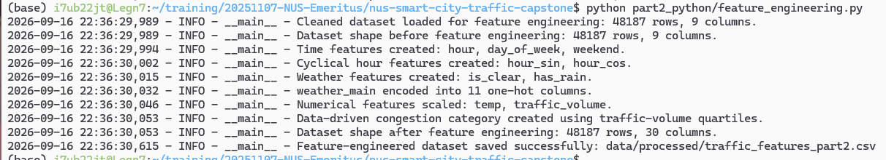
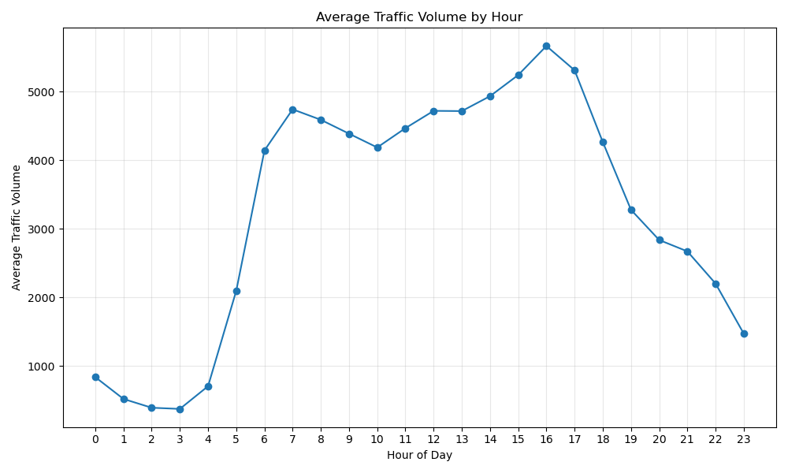
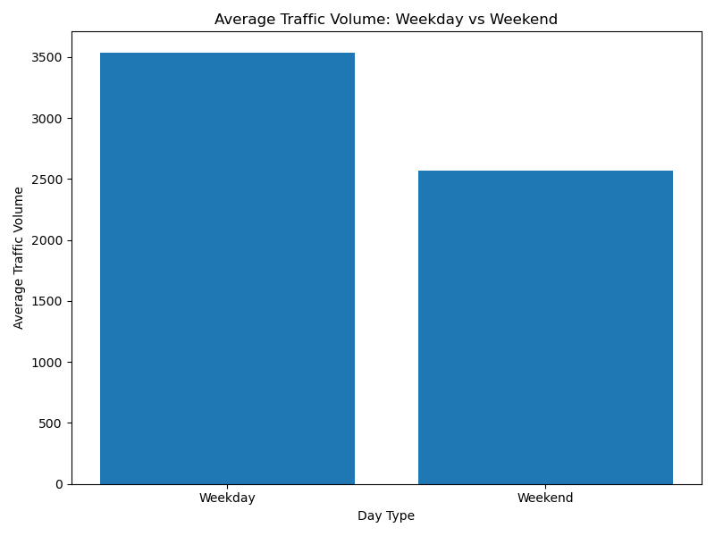
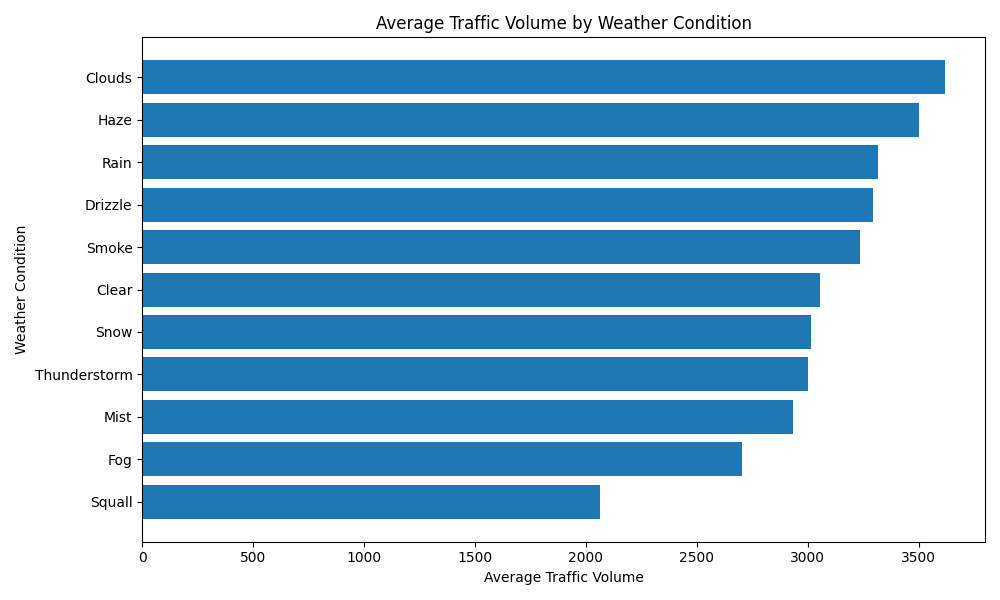
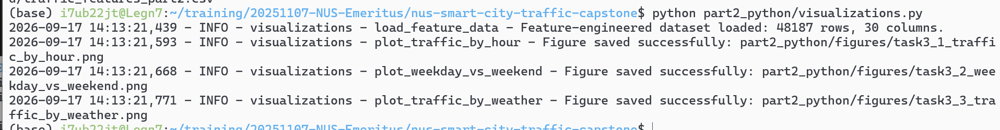
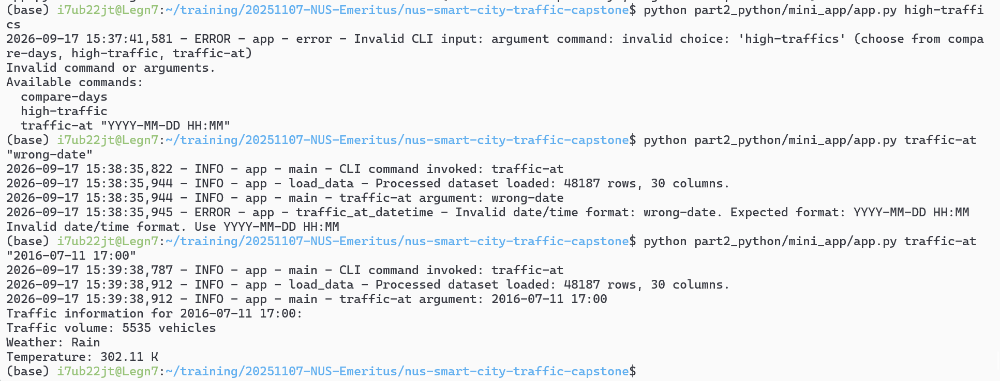

# NUS Smart City Traffic Capstone

Capstone Project: Smart City Traffic Intelligence — From Data Analytics to AI-Powered Mobility.

## Hardware and GPU Notes

Most of this project can run on CPU, including:

- SQL/statistical analysis
- Python data cleaning and feature engineering
- Matplotlib visualisations
- Scikit-learn models

A GPU is optional but recommended for the deep-learning component.

This project was developed in WSL2 with an NVIDIA GPU-enabled TensorFlow environment.
Users without a compatible GPU can still run the deep-learning code on CPU, although training may be slower.

## Conda environments

The environment specification is stored in:
- environment.yml
- environment-tensorflow.yml

To recreate the environment:

conda env create -f environment.yml

conda activate pytorch310

conda env create -f environment-tensorflow.yml

conda activate tf_wsl2_310

## Project Structure
- `data/` - raw and processed traffic data
- `part1_data_analytics/` - SQL, SQL db, statistical and probability analysis, Power BI dashboard, Data Analytics Insights Report
- `part2_python/` - Python data pipeline, feature engineering, visualisation and mini application
- `part3_machine_learning/` - machine learning, deep learning, explainability and MLOps

## Part 1
- `part1_data_analytics/` 
  - part1_data_analytics_insights_report.pdf
    [Read the Part 1 Data Analytics Insights Report](part1_data_analytics/part1_data_analytics_insights_report.pdf)

### Task 1.1 - Load and Clean Dataset
- `data/`
  - `raw/Metro_Interstate_Traffic_Volume.csv`  - raw dataset
  - `processed/traffic_clean.csv`              - clean dataset
- `part1_data_analytics/` 
  - `traffic.db` - SQLite database containing raw and cleaned traffic tables
    - `traffic` - table with raw traffic records
    - `traffic_clean` - table with cleaned traffic records
  - `load_sqlite.py` - load raw dataset to traffic table
  - `inspect_data.py` - inspect raw dataset
  - `clean_data.py` - create traffic_clean.csv, traffic_clean table 

- cleaning done
  - Preserved the original raw CSV and raw SQLite traffic table unchanged.
  - Removed 17 exact duplicate rows. Raw dataset has 48,204 rows, cleaned dataset has 48,187 rows.
  - Replaced missing holiday values with None.
  - Standardised weather_description text to lowercase.
  - Replaced 10 invalid temperature readings of 0 K using the median temperature for the corresponding month.
  - Replaced one extreme rainfall value of 9831.3 mm with the median positive rainfall for the same month.
  - Verified that the cleaned dataset contains no duplicate rows, invalid dates, temperatures at or below 0 K, extreme rainfall values, invalid cloud-cover values, or negative traffic volumes.
  - Saved the cleaned data as `data/processed/traffic_clean.csv` and as the traffic_clean table in traffic.db.

### Task 1.2 - Annual Traffic Trend Findings
- `part1_data_analytics/` 
  - `task1_2_annual_traffic.sql`
  - `task1_2a_check_days.sql`

* Annual totals for 2012, 2014 and 2015 should be interpreted cautiously because those years have incomplete data coverage.
* 2012 contains only 91 days of records, 2014 contains 214 days, and 2015 contains 195 days.
* Therefore, large year-on-year percentage changes involving these years mainly reflect differences in data availability rather than true traffic growth or decline.
* 2016 and 2017 both have complete yearly coverage.
* Traffic volume increased from 29,471,608 in 2016 to 35,393,801 in 2017, an increase of approximately 20.09%.

### Task 1.3 - Holiday Temperature Findings
- `part1_data_analytics/` 
  - `task1_3_holiday_temperature.sql`
  - `task1_3a_duplicate_holidays.sql`
  - `task1_3b_enhanced_holiday_temperature.sql`

* Labor Day temperatures were fairly stable across the three available years: 21.87°C in 2015, 20.02°C in 2016, and 22.39°C in 2017. 
* Labor Day traffic volume also remained relatively similar, ranging from 973 to 1,064 vehicles. This suggests no obvious strong relationship between the small temperature differences and traffic volume for these observations. 
* New Years Day was much colder than Labor Day. The recorded temperature increased from -7.21°C in 2016 to -2.53°C in 2017. 
* Traffic volume on New Years Day decreased from 1,513 vehicles in 2016 to 798 vehicles in 2017, even though 2017 was warmer. This indicates that temperature alone does not explain the traffic difference. 
* No New Years Day record is available for 2015 because the 2015 dataset begins only in June. 
* These results should be interpreted cautiously because the holiday field represents specific recorded timestamps, not a complete set of hourly observations for the whole holiday. 
* There is no clear evidence here that temperature alone drove holiday traffic volume.

### Task 2.1 - Descriptive Statistics Findings
- `part1_data_analytics/` 
  - `task2_1_statistics.py`  

* The mean traffic volume is 3,259.62 vehicles, while the median is 3,379 vehicles, indicating that the distribution is fairly balanced but slightly influenced by lower traffic-volume observations.
* The standard deviation of 1,986.95 vehicles shows substantial variation in traffic volume across different hours.
* The large variance of 3,947,988.05 reflects the same high level of dispersion in squared units.
* The traffic-volume range is 7,280 vehicles, from a minimum of 0 to a maximum of 7,280, showing that traffic conditions vary widely from very low to very high volume periods.

### Task 2.2 - Correlation Findings
- `part1_data_analytics/` 
  - `task2_2_correlation.py` 

* The Pearson correlation coefficient between temperature and traffic volume is approximately 0.1323.
* This indicates a very weak positive relationship.
* Higher temperatures are associated with slightly higher traffic volumes, but the relationship is weak.
* Correlation does not imply causation, as traffic volume is also affected by time of day, day type, holidays, weather conditions, and commuting patterns.

### Task 3.1 - Basic Probability Findings
- `part1_data_analytics/` 
  - `task3_1_basic_probability.py`

* Congestion occurred in approximately 14.73% of traffic records.
* Clear weather occurred in approximately 27.78% of records.
* Approximately 3.66% of all records experienced both congestion and clear weather.
* This suggests that congestion is not limited to poor-weather conditions and can also occur during clear weather.

### Task 3.2 - Conditional Probability Findings
- `part1_data_analytics/` 
  - `task3_2_conditional_probability.py`

* About 24.83% of congested records occurred during clear weather.
* About 26.30% of congested records occurred when temperature exceeded 292K.
* P(Clear AND Congestion) = 0.0366 differs from P(Clear) × P(Congestion) = 0.0409, suggesting clear weather and congestion are not perfectly independent.
* The odds ratio of 0.7355 indicates that the odds of congestion during clear weather were about 26% lower than during cloudy weather.
* Overall, weather appears to have some association with congestion, but it is clearly not the only factor affecting traffic conditions.

### Task 4 - Power BI Traffic Intelligence Dashboard
- `part1_data_analytics/` 
  - `task4_powerbi_dashboard.pbix`

#### Task 4.1

* Power BI file is based on the raw 48,204-row dataset, whereas the cleaned Python dataset has 48,187 rows after removing 17 exact duplicates
* check and correct data types
* Extract Hour from date_time.
* Create Temperature_Celsius from Kelvin.
* Create Traffic Category:
  * < 4500 → Low
  * 4500–5500 → Medium
  * > 5500 → High.

#### Task 4.2A Daily traffic trends for 2015, 2016 and 2017

#### Task 4.2B Hourly Traffic Patterns for 2017

#### Task 4.2C – Weather Impact Findings

* Cloudy conditions had the highest average traffic volume at approximately 3,618 vehicles.
* Squall conditions had the lowest average traffic volume at approximately 2,062 vehicles.
* The difference between the highest and lowest average traffic was 1,557 vehicles.
* This suggests traffic volume varies across weather conditions, though weather alone should not be treated as the sole cause of the differences.

#### Task 4.2D – Temperature vs Traffic Findings

* Invalid temperature records where temp = 0 K are set to null before Celsius conversion.
* The scatter plot shows no clear visual relationship between temperature and traffic volume. 
* Traffic levels are broadly similar across approximately −20°C to +30°C, with no distinct temperature band associated with higher traffic. 
* This is consistent with the weak positive correlation coefficient of 0.1323.

#### Task 4.3 – KPI cards and Filters

## Part 2 - Python Programming
- `part2_python/` 
  - part2_methodology_findings_report.pdf
    [Read the Part 2 Methodology Findings Report](part2_python/part2_methodology_findings_report.pdf)

### Task 1 - Data Pipeline Construction
- `part2_python/` 
  - `pipeline.py`
- `data/`
  - `processed/traffic_clean_part2.csv`

An end-to-end Python data pipeline was developed in `part2_python/pipeline.py` that:

- Loads the raw CSV dataset.
- Validates the expected data schema before processing.
- Standardises categorical fields.
- Parses and validates `date_time`.
- Removes 17 exact duplicate rows.
- Imputes 10 invalid 0 K temperature readings using the corresponding monthly median temperatures.
- Imputes one extreme rainfall outlier using the July positive-rainfall median.
- Validates the cleaned dataset after processing.
- Saves the cleaned dataset to `data/processed/traffic_clean_part2.csv`.
- Logs each processing step using appropriate INFO, WARNING, and ERROR logging levels.

**Result:** The raw dataset contains 48,204 rows and 9 columns. After removing 17 exact duplicate rows, the cleaned dataset contains 48,187 rows and 9 columns.

### Task 2 - Feature Engineering

- `part2_python/`
  - `feature_engineering.py`
- `data/`
  - `processed/traffic_features_part2.csv`

The cleaned dataset from Task 1 was transformed into ML-ready features using NumPy and Pandas.

The feature-engineering process:

- Loads `data/processed/traffic_clean_part2.csv`.
- Logs the dataset shape before feature engineering.
- Creates time-based features:
  - `hour`
  - `day_of_week`
  - `weekend`
- Creates cyclical hour encodings:
  - `hour_sin`
  - `hour_cos`
- Creates derived weather indicators:
  - `is_clear`
  - `has_rain`
- One-hot encodes `weather_main` into 11 weather-category columns.
- Standardises the continuous variables:
  - `temp`
  - `traffic_volume`
- Creates a data-driven `congestion_category` using traffic-volume quartiles:
  - Q1 = 1,192.5
  - Q3 = 4,933.0
  - Low: up to the first quartile (Q1)
  - Medium: between Q1 and Q3
  - High: above the third quartile (Q3)
- Logs intermediate scaling and threshold values at DEBUG level.
- Logs the dataset shape after feature engineering.
- Saves the engineered dataset to `data/processed/traffic_features_part2.csv`.

**Result:** The cleaned dataset contains 48,187 rows and 9 columns. After feature engineering, the dataset contains 48,187 rows and 30 columns.

### Task 3 - Traffic Visualisations

- `part2_python/`
  - `visualizations.py`
  - `figures/`
    - `task3_1_traffic_by_hour.png`
    - `task3_2_weekday_vs_weekend.png`
    - `task3_3_traffic_by_weather.png`
  - `images/`
    - `task3_visualization.png`

Three Matplotlib visualisations were created from the feature-engineered dataset and saved to `part2_python/figures/`.

#### Task 3.1 - Traffic Demand by Hour

- Traffic volume is lowest during the overnight period, particularly around 2–3 AM.
- Traffic rises sharply between approximately 5 AM and 7 AM.
- Traffic remains relatively high throughout the daytime.
- The highest average traffic volume occurs around 4 PM.
- Traffic declines progressively during the evening.

#### Task 3.2 - Weekday vs Weekend Traffic

- Average traffic volume is substantially higher on weekdays than on weekends.
- Weekday traffic averages approximately 3,500 vehicles, compared with approximately 2,600 on weekends.
- This suggests that workday and commuting activity are important contributors to traffic demand.

#### Task 3.3 - Traffic by Weather Condition

- Average traffic volume varies across weather conditions.
- Cloudy conditions have the highest average traffic volume, at approximately 3,618 vehicles.
- Squall conditions have the lowest average traffic volume, at approximately 2,062 vehicles.
- Clear weather is not associated with the highest traffic levels.
- Weather appears to influence traffic patterns, but weather alone does not explain overall traffic demand.

**Note:** Part 1 Task 4.2C was calculated in Power BI using the raw 48,204-row dataset, which still included 17 exact duplicate records. Part 2 Task 3.3 was calculated in Python using the cleaned 48,187-row dataset after those duplicates were removed. This explains the small decimal point differences in the reported average traffic values.

#### Task 3 Execution and Logging

The visualisation script records each successfully generated figure in `part2_python/pipeline.log`. The log includes the Python module and function name for easier tracing.

**Result:** Three Matplotlib visualisations were successfully generated and saved to disk, with each output recorded in the Part 2 pipeline log.

### Task 4 - Mini Traffic Analytics Application

- `part2_python/mini_app/`
  - `app.py`

A command-line traffic analytics application was developed using Python's `argparse` module and the feature-engineered dataset `data/processed/traffic_features_part2.csv`. A custom `TrafficArgumentParser` class extends `argparse.ArgumentParser` to provide clearer error messages and log invalid command-line input.

The application supports three commands:

#### Command 1 - Compare Weekday and Weekend Traffic

`python part2_python/mini_app/app.py compare-days`

This command compares average weekday and weekend traffic volumes.

Example result:

* Average weekday traffic volume: approximately 3,533 vehicles.
* Average weekend traffic volume: approximately 2,571 vehicles.

#### Command 2 - Identify High-Traffic Hours

`python part2_python/mini_app/app.py high-traffic`

This command displays the five hours with the highest average traffic volume.

The highest average traffic period occurs at approximately 16:00, followed by 17:00 and 15:00.

#### Command 3 - Query Traffic at a Specific Date and Time

`python part2_python/mini_app/app.py traffic-at "2016-07-11 17:00"`

Example result:

* Traffic volume: 5,535 vehicles.
* Weather: Rain.
* Temperature: 302.11 K.

The application also validates user input:

* Invalid commands generate a logged ERROR and display the available commands.
* Invalid date/time values generate a logged ERROR and display the expected `YYYY-MM-DD HH:MM` format.
* User-facing query results are displayed using `print()`, while internal status and errors are handled through Python logging.

**Result:** The mini-application successfully supports three different traffic queries and handles invalid user input without producing an unhandled traceback.

### Task 5 - GitHub and Reproducibility

The Part 2 Python workflow is maintained in GitHub using incremental commits corresponding to the major development tasks:

* Data pipeline construction
* Feature engineering
* Traffic visualisations
* Command-line application
* Documentation and logging improvements

#### Logging Configuration

All Part 2 Python modules use:

`logging.getLogger(__name__)`

Logs are written to:

`part2_python/pipeline.log`

The logging formatter records:

* Timestamp
* Log level
* Module name
* Function name
* Message

The following logging levels are used:

* `DEBUG` - Fine-grained intermediate values used for troubleshooting, such as scaling statistics and congestion thresholds.
* `INFO` - Normal processing milestones, such as loading data, completing feature engineering, and saving output files.
* `WARNING` - Recoverable data-quality issues, such as duplicate removal and outlier imputation.
* `ERROR` - Errors that prevent normal processing or indicate invalid application input.

Internal status and progress messages are handled through logging. `print()` is used only for output intended directly for users of the command-line application.

#### Reproducible Execution Order

Run the Part 2 workflow from the repository root in the following order:

`python part2_python/pipeline.py`

`python part2_python/feature_engineering.py`

`python part2_python/visualizations.py`

The mini-application can then be run using:

`python part2_python/mini_app/app.py compare-days`

`python part2_python/mini_app/app.py high-traffic`

`python part2_python/mini_app/app.py traffic-at "2016-07-11 17:00"`

**Result:** The Part 2 workflow is version-controlled, logged, reproducible, and can be executed sequentially from the raw dataset through cleaning, feature engineering, visualisation and command-line analysis.

#### CLI Error Handling Tests

The following commands can be used to reproduce and verify the application's error handling:

`python part2_python/mini_app/app.py traffic-at "wrong-date"`

This verifies handling of a valid `traffic-at` command with an invalid date/time argument. The application logs an `ERROR` and displays the required `YYYY-MM-DD HH:MM` format without producing a traceback.

`python part2_python/mini_app/app.py traffic-`

This verifies handling of an invalid command. The custom `TrafficArgumentParser` logs an `ERROR` and displays the three supported commands.

## Part 3 - Machine Learning, Deep Learning and AI

Part 3 extends the cleaned and feature-engineered traffic dataset from Part 2 into supervised machine learning, unsupervised learning, deep learning and model explainability.

The Part 2 feature-engineered dataset used as the main input is:

`data/processed/traffic_features_part2.csv`

The dataset contains 48,187 cleaned records and 30 columns.

---

### Task 1 - Supervised Machine Learning Models

Script:

`part3_machine_learning/supervised_models.py`

Task 1 develops both classification and regression models using a common engineered feature set.

#### Classification Target

Because no real accident dataset was provided, a proxy accident-risk target was created as required by the assignment.

Traffic congestion was first divided into four data-driven categories using traffic-volume quartiles:

* Low: traffic volume <= Q1 = 1,192.50
* Medium: traffic volume <= Q2 = 3,379.00
* High: traffic volume <= Q3 = 4,933.00
* Severe: traffic volume > Q3

The binary proxy target `high_risk` was then created using congestion and weather conditions.

High risk is defined as:

* High or Severe congestion
* AND
* severe weather or low-visibility weather

The resulting target distribution was:

* `high_risk = 1` -> 5,438 records
* `low_risk = 0` -> 42,749 records

This proxy label is used only to demonstrate the machine-learning classification workflow and should not be interpreted as a prediction of actual accidents.

#### Classification Features

A common set of 21 engineered features was used, including:

* cyclical hour features: `hour_sin`, `hour_cos`
* cyclical day features: `day_sin`, `day_cos`
* weekend indicator
* holiday flag
* scaled temperature
* rainfall
* snowfall
* cloud coverage
* one-hot encoded weather categories

`traffic_volume`, `traffic_volume_scaled`, and congestion category were not used as classification inputs because they were directly involved in creating the proxy target and would introduce target leakage.

#### Classification Models

Two classification algorithms were trained using an 80% training and 20% test split with stratification.

**Logistic Regression**

* Accuracy: 0.9788
* Precision: 0.9123
* Recall: 0.8989
* F1-score: 0.9056
* ROC AUC: 0.9938

**Random Forest Classifier**

* Accuracy: 0.9841
* Precision: 0.9277
* Recall: 0.9320
* F1-score: 0.9298
* ROC AUC: 0.9970

The Random Forest Classifier achieved stronger performance across all reported classification metrics.

#### Regression Target

The regression models predict:

`traffic_volume`

The same engineered feature set was used, excluding `traffic_volume_scaled` to prevent target leakage.

#### Regression Models

Two regression algorithms were trained.

**Linear Regression**

* MAE: 834.09 vehicles
* R-squared: 0.7092

**Random Forest Regressor**

* MAE: 269.83 vehicles
* R-squared: 0.9449

The Random Forest Regressor produced substantially lower prediction error and explained approximately 94.5% of the variation in traffic volume.

---

### Task 2 - Unsupervised Machine Learning

Script:

`part3_machine_learning/unsupervised_models.py`

Task 2 applies K-means clustering and association rule mining to identify traffic patterns without a predefined prediction target.

#### Task 2.1 - K-means Clustering

K-means clustering was applied using:

* hour
* traffic volume
* weather severity

Weather severity was encoded as:

* 0 = relatively normal weather
* 1 = rain or drizzle
* 2 = low-visibility weather
* 3 = severe weather

The input variables were standardized before clustering.

Four clusters were created.

**Cluster 0**

* Records: 8,309
* Average hour: 12.42
* Average traffic volume: 4,072.76
* Average weather severity: 2.38

Interpretation: daytime traffic under poor or severe weather conditions.

**Cluster 1**

* Records: 13,209
* Average hour: 2.95
* Average traffic volume: 833.91
* Average weather severity: 0.73

Interpretation: overnight low-traffic conditions.

**Cluster 2**

* Records: 17,449
* Average hour: 12.35
* Average traffic volume: 5,075.93
* Average weather severity: 0.20

Interpretation: busy daytime traffic under generally normal weather.

**Cluster 3**

* Records: 9,220
* Average hour: 20.77
* Average traffic volume: 2,564.61
* Average weather severity: 0.31

Interpretation: evening traffic with moderate traffic volume and generally normal weather.

#### Task 2.2 - Association Rule Mining

Association rule mining was performed using categorical representations of:

* time of day
* weekday or weekend
* weather group
* congestion level

The transaction matrix contained:

* 48,187 records
* 14 categorical items
* 149 frequent itemsets

After filtering the rules so that the consequent contains exactly one congestion category, 62 congestion-prediction rules were identified.

Representative high-lift rules include:

**Weekend Night -> Low Congestion**

* Support: 0.0644
* Confidence: 0.8861
* Lift: 3.5443

Interpretation: when the record occurs on a weekend night, approximately 88.6% of these cases have Low congestion. Low congestion is approximately 3.54 times more likely than its general occurrence.

**Weekend Afternoon + Normal Weather -> High Congestion**

* Support: 0.0387
* Confidence: 0.8454
* Lift: 3.3797

Interpretation: on weekend afternoons with normal weather, approximately 84.5% of records have High congestion.

Overall, the association rules show a strong relationship between night-time travel and Low congestion, while some weekend daytime periods are associated with higher congestion.

---

### Task 3 - Deep Learning with Explainability

Scripts:

* `part3_machine_learning/deep_learning.py`
* `part3_machine_learning/explainability.py`

#### Neural Network

A PyTorch feed-forward neural network was developed to predict traffic volume using the same 21 engineered input features.

The neural network architecture contains:

* input layer
* 64-neuron hidden layer with ReLU
* 32-neuron hidden layer with ReLU
* single regression output

The model was trained for 50 epochs using Adam optimization and mean squared error loss.

CUDA was successfully used for neural-network training.

**Neural Network Regression Results**

* MAE: 280.12 vehicles
* R-squared: 0.9437

The neural network achieved strong predictive performance and performed close to the Random Forest Regressor.

For comparison:

* Random Forest Regressor MAE: 269.83
* Neural Network MAE: 280.12
* Random Forest Regressor R-squared: 0.9449
* Neural Network R-squared: 0.9437

The Random Forest Regressor remained slightly stronger on this dataset.

The neural-network artifacts are saved under:

`part3_machine_learning/models/`

including:

* `neural_network_regression.pt`
* `nn_x_scaler.joblib`
* `nn_y_scaler.joblib`

#### SHAP Explainability

SHAP was used to explain a comparable Random Forest Regressor trained on the same traffic-volume prediction problem.

A model-agnostic Permutation SHAP explainer was used because the tree-specific SHAP implementation produced a low-level segmentation fault in the project environment.

To control computational cost, SHAP explanations were generated for a representative sample of 200 test records.

Generated figures:

* `part3_machine_learning/figures/task3_shap_summary.png`
* `part3_machine_learning/figures/task3_shap_feature_importance.png`

The SHAP results show that time of day is the strongest driver of predicted traffic volume.

The most influential features were:

* `hour_cos`
* `hour_sin`
* `day_sin`
* `weekend`
* `temp_scaled`
* `day_cos`

The two cyclical hour variables jointly represent time of day and should therefore be interpreted together rather than individually.

The SHAP summary plot also shows that weekend records generally reduce predicted traffic volume, which is consistent with the earlier descriptive analysis showing lower weekend traffic.

Weather variables such as cloud coverage and individual weather categories contributed less to overall model predictions than time-based features.

Overall, Task 3 shows that traffic demand is driven primarily by recurring time-of-day and day-of-week patterns, with weather contributing a smaller secondary effect.

### Task 4 - Advanced AI Technique with MLflow

Script:

`part3_machine_learning/advanced_ai_mlflow.py`

MLflow was selected as the advanced AI technique because it provides structured experiment tracking and connects directly with the later MLOps requirements.

The MLflow experiment is named:

`smart_city_traffic_models`

The experiment currently tracks four supervised models developed in Task 1:

* Logistic Regression Classification
* Random Forest Classification
* Linear Regression
* Random Forest Regression

For the classification models, MLflow records:

* model type
* model parameters
* Accuracy
* Precision
* Recall
* F1-score
* ROC AUC

For the regression models, MLflow records:

* model type
* model parameters
* MAE
* R-squared

The MLflow configuration uses a local SQLite backend:

`part3_machine_learning/mlflow.db`

This database stores experiment metadata such as:

* experiment information
* run IDs
* parameters
* evaluation metrics
* model metadata

The normal Python execution log remains separate:

`part3_machine_learning/part3.log`

The MLflow script uses the same 21 engineered features, target definitions, train/test split settings and model parameters used in Task 1 so that the tracked results remain consistent with the original supervised-learning experiments.

Each execution of `advanced_ai_mlflow.py` creates a new set of MLflow runs under the same experiment rather than overwriting earlier runs.

MLflow therefore provides a reproducible experiment history that can later support:

* model comparison
* model versioning
* experiment tracking
* deployment documentation
* MLOps monitoring

This technique was selected because it adds traceability and reproducibility without changing the underlying machine-learning models.

A limitation is that repeated executions create additional run records, so unnecessary repeated runs should be avoided in the final project state.

### Task 5 - Traffic Recommendation System

Script:

`part3_machine_learning/recommendation_system.py`

Because the dataset represents a single traffic corridor, the recommendation system focuses on **travel timing** rather than route selection.

The system:

* filters historical traffic records by weekday or weekend
* optionally considers a specified weather condition
* restricts recommendations to practical travel hours from 06:00 to 22:00
* calculates the average traffic volume for each eligible hour
* recommends the one-hour period with the lowest historical average traffic
* generates a plain-language recommendation for the user

For a weekday journey, the current historical analysis recommends travelling between **21:00 and 22:00**, when average traffic volume is approximately **2,673 vehicles**.

The practical-hour restriction prevents the system from selecting very low-traffic overnight periods, such as 02:00–03:00, which may be mathematically optimal but less useful for typical travel planning.

