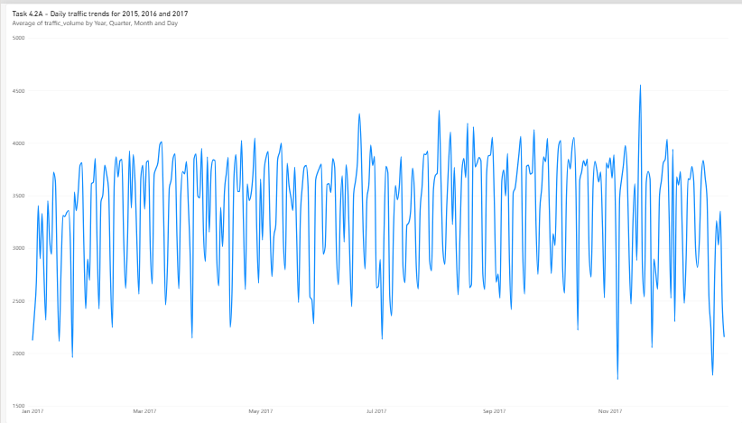
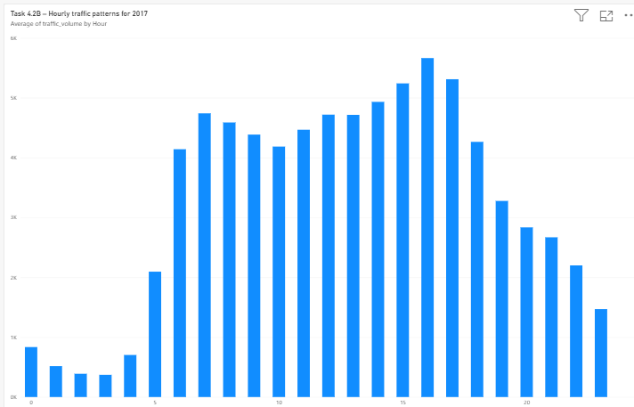
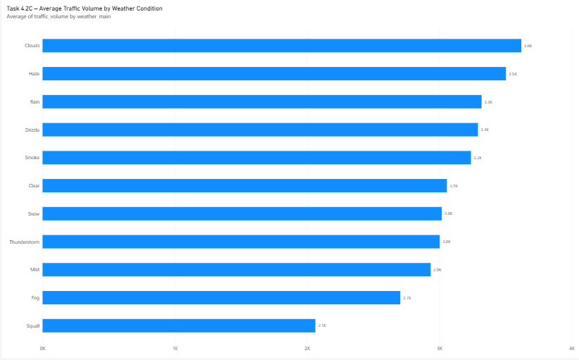
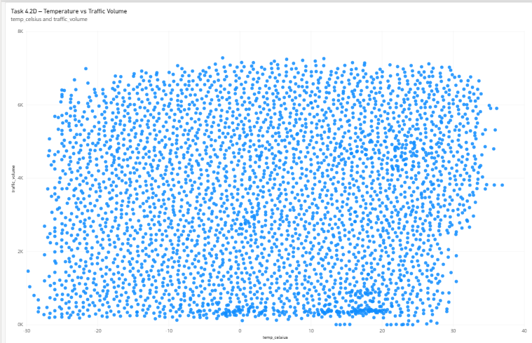
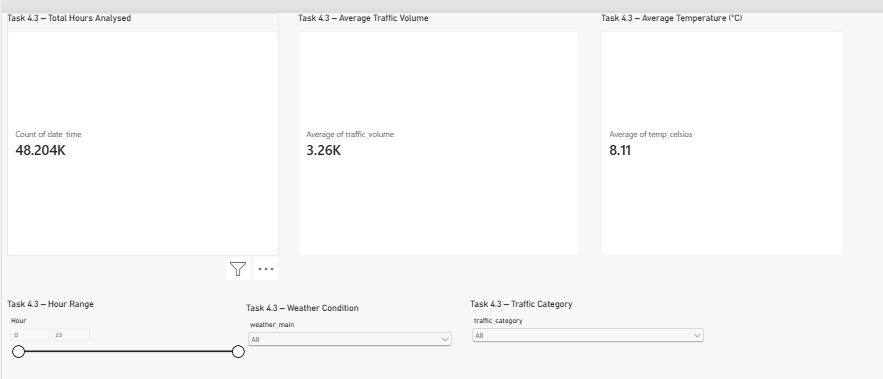
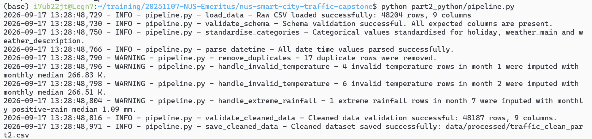

# NUS Smart City Traffic Capstone

Capstone Project: Smart City Traffic Intelligence — From Data Analytics to AI-Powered Mobility.

## Hardware and GPU Notes

Most of this project can run on CPU, including:

- SQL/statistical analysis
- Python data cleaning and feature engineering
- Matplotlib visualisations
- Scikit-learn models

A GPU is optional but recommended for the deep-learning component.

This project was developed in WSL2 with an NVIDIA GPU-enabled TensorFlow environment.
Users without a compatible GPU can still run the deep-learning code on CPU, although training may be slower.

## Conda environments

The environment specification is stored in:
- environment.yml
- environment-tensorflow.yml

To recreate the environment:

conda env create -f environment.yml

conda activate pytorch310

conda env create -f environment-tensorflow.yml

conda activate tf_wsl2_310

## Project Structure
- `data/` - raw and processed traffic data
- `part1_data_analytics/` - SQL, SQL db, statistical and probability analysis, Power BI dashboard, Data Analytics Insights Report
- `part2_python/` - Python data pipeline, feature engineering, visualisation and mini application
- `part3_machine_learning/` - machine learning, deep learning, explainability and MLOps

## Part 1
- `part1_data_analytics/` 
  - part1_data_analytics_insights_report.pdf
    [Read the Part 1 Data Analytics Insights Report](part1_data_analytics/part1_data_analytics_insights_report.pdf)

### Task 1.1 - Load and Clean Dataset
- `data/`
  - `raw/Metro_Interstate_Traffic_Volume.csv`  - raw dataset
  - `processed/traffic_clean.csv`              - clean dataset
- `part1_data_analytics/` 
  - `traffic.db` - SQLite database containing raw and cleaned traffic tables
    - `traffic` - table with raw traffic records
    - `traffic_clean` - table with cleaned traffic records
  - `load_sqlite.py` - load raw dataset to traffic table
  - `inspect_data.py` - inspect raw dataset
  - `clean_data.py` - create traffic_clean.csv, traffic_clean table 

- cleaning done
  - Preserved the original raw CSV and raw SQLite traffic table unchanged.
  - Removed 17 exact duplicate rows. Raw dataset has 48,204 rows, cleaned dataset has 48,187 rows.
  - Replaced missing holiday values with None.
  - Standardised weather_description text to lowercase.
  - Replaced 10 invalid temperature readings of 0 K using the median temperature for the corresponding month.
  - Replaced one extreme rainfall value of 9831.3 mm with the median positive rainfall for the same month.
  - Verified that the cleaned dataset contains no duplicate rows, invalid dates, temperatures at or below 0 K, extreme rainfall values, invalid cloud-cover values, or negative traffic volumes.
  - Saved the cleaned data as `data/processed/traffic_clean.csv` and as the traffic_clean table in traffic.db.

### Task 1.2 - Annual Traffic Trend Findings
- `part1_data_analytics/` 
  - `task1_2_annual_traffic.sql`
  - `task1_2a_check_days.sql`

* Annual totals for 2012, 2014 and 2015 should be interpreted cautiously because those years have incomplete data coverage.
* 2012 contains only 91 days of records, 2014 contains 214 days, and 2015 contains 195 days.
* Therefore, large year-on-year percentage changes involving these years mainly reflect differences in data availability rather than true traffic growth or decline.
* 2016 and 2017 both have complete yearly coverage.
* Traffic volume increased from 29,471,608 in 2016 to 35,393,801 in 2017, an increase of approximately 20.09%.

### Task 1.3 - Holiday Temperature Findings
- `part1_data_analytics/` 
  - `task1_3_holiday_temperature.sql`
  - `task1_3a_duplicate_holidays.sql`
  - `task1_3b_enhanced_holiday_temperature.sql`

* Labor Day temperatures were fairly stable across the three available years: 21.87°C in 2015, 20.02°C in 2016, and 22.39°C in 2017. 
* Labor Day traffic volume also remained relatively similar, ranging from 973 to 1,064 vehicles. This suggests no obvious strong relationship between the small temperature differences and traffic volume for these observations. 
* New Years Day was much colder than Labor Day. The recorded temperature increased from -7.21°C in 2016 to -2.53°C in 2017. 
* Traffic volume on New Years Day decreased from 1,513 vehicles in 2016 to 798 vehicles in 2017, even though 2017 was warmer. This indicates that temperature alone does not explain the traffic difference. 
* No New Years Day record is available for 2015 because the 2015 dataset begins only in June. 
* These results should be interpreted cautiously because the holiday field represents specific recorded timestamps, not a complete set of hourly observations for the whole holiday. 
* There is no clear evidence here that temperature alone drove holiday traffic volume.

### Task 2.1 - Descriptive Statistics Findings
- `part1_data_analytics/` 
  - `task2_1_statistics.py`  

* The mean traffic volume is 3,259.62 vehicles, while the median is 3,379 vehicles, indicating that the distribution is fairly balanced but slightly influenced by lower traffic-volume observations.
* The standard deviation of 1,986.95 vehicles shows substantial variation in traffic volume across different hours.
* The large variance of 3,947,988.05 reflects the same high level of dispersion in squared units.
* The traffic-volume range is 7,280 vehicles, from a minimum of 0 to a maximum of 7,280, showing that traffic conditions vary widely from very low to very high volume periods.

### Task 2.2 - Correlation Findings
- `part1_data_analytics/` 
  - `task2_2_correlation.py` 

* The Pearson correlation coefficient between temperature and traffic volume is approximately 0.1323.
* This indicates a very weak positive relationship.
* Higher temperatures are associated with slightly higher traffic volumes, but the relationship is weak.
* Correlation does not imply causation, as traffic volume is also affected by time of day, day type, holidays, weather conditions, and commuting patterns.

### Task 3.1 - Basic Probability Findings
- `part1_data_analytics/` 
  - `task3_1_basic_probability.py`

* Congestion occurred in approximately 14.73% of traffic records.
* Clear weather occurred in approximately 27.78% of records.
* Approximately 3.66% of all records experienced both congestion and clear weather.
* This suggests that congestion is not limited to poor-weather conditions and can also occur during clear weather.

### Task 3.2 - Conditional Probability Findings
- `part1_data_analytics/` 
  - `task3_2_conditional_probability.py`

* About 24.83% of congested records occurred during clear weather.
* About 26.30% of congested records occurred when temperature exceeded 292K.
* P(Clear AND Congestion) = 0.0366 differs from P(Clear) × P(Congestion) = 0.0409, suggesting clear weather and congestion are not perfectly independent.
* The odds ratio of 0.7355 indicates that the odds of congestion during clear weather were about 26% lower than during cloudy weather.
* Overall, weather appears to have some association with congestion, but it is clearly not the only factor affecting traffic conditions.

### Task 4 - Power BI Traffic Intelligence Dashboard
- `part1_data_analytics/` 
  - `task4_powerbi_dashboard.pbix`

#### Task 4.1

* Power BI file is based on the raw 48,204-row dataset, whereas the cleaned Python dataset has 48,187 rows after removing 17 exact duplicates
* check and correct data types
* Extract Hour from date_time.
* Create Temperature_Celsius from Kelvin.
* Create Traffic Category:
  * < 4500 → Low
  * 4500–5500 → Medium
  * > 5500 → High.

#### Task 4.2A Daily traffic trends for 2015, 2016 and 2017

#### Task 4.2B Hourly Traffic Patterns for 2017

#### Task 4.2C – Weather Impact Findings

* Cloudy conditions had the highest average traffic volume at 3,618.45 vehicles.
* Squall conditions had the lowest average traffic volume at 2,061.45 vehicles.
* The difference between the highest and lowest average traffic was 1,557 vehicles.
* This suggests traffic volume varies across weather conditions, though weather alone should not be treated as the sole cause of the differences.

#### Task 4.2D – Temperature vs Traffic Findings

* Invalid temperature records where temp = 0 K are set to null before Celsius conversion.
* The scatter plot shows no clear visual relationship between temperature and traffic volume. 
* Traffic levels are broadly similar across approximately −20°C to +30°C, with no distinct temperature band associated with higher traffic. 
* This is consistent with the weak positive correlation coefficient of 0.1323.

#### Task 4.3 – KPI cards and Filters

## Part 2 - Python Programming

### Task 1 - Data Pipeline Construction
- `part2_python/` 
  - `pipeline.py`

An end-to-end Python data pipeline was developed in `part2_python/pipeline.py` that:

- Loads the raw CSV dataset.
- Validates the expected data schema before processing.
- Standardises categorical fields.
- Parses and validates `date_time`.
- Removes 17 exact duplicate rows.
- Imputes 10 invalid 0 K temperature readings using the corresponding monthly median temperatures.
- Imputes one extreme rainfall outlier using the July positive-rainfall median.
- Validates the cleaned dataset after processing.
- Saves the cleaned dataset to `data/processed/traffic_clean_part2.csv`.
- Logs each processing step using appropriate INFO, WARNING, and ERROR logging levels.

Result: The raw dataset contains 48,204 rows and 9 columns. After removing 17 exact duplicate rows, the cleaned dataset contains 48,187 rows and 9 columns.

